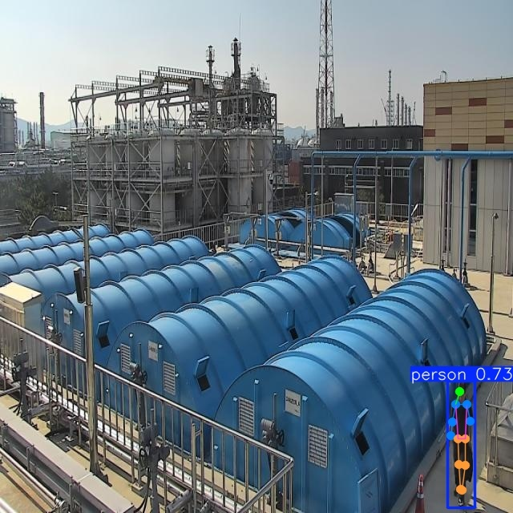

# IndustrialMotionDetection 

<!-- markdownlint-disable MD033 -->
<p align="center">
    
    
</p>
<!-- markdownlint-enable MD033 -->

**IndustrialMotionDetection** - это библиотека для распознавания действий человека на производстве.

В условиях существующих систем видеонаблюдения существует потребность в инструментах, способных точно идентифицировать некоторые действия работников и своевременно предупреждать о потенциально опасных ситуациях. На данный момент решения в этой области ограничены коммерческими продуктами, доступ к которым затруднен для широкого круга пользователей, либо носят узкоспециализированный характер и требуют адаптации под конкретные условия применения.

**В результате чего наша команда выделила набор актуальных действий:**

1) Перемещение предметов, оборудования
2) Использование инструментов
3) Использование смартфона/телефона
4) Курение
5) Прием пищи или напитков
6) Нахождение на рабочем месте в определенной зоне
7) Взаимодействие с другими людьми (разговор, рукопожатие, объятие) 
8) Поднятие по лестнице с тремя точками опоры
9) Нахождение человека в запретной зоне
10) Саботаж камер

## Как использовать?

- склонируйте репозиторий

```bash
git clone https://github.com/CTLab-ITMO/IndustrialMotionDetection.git
cd IndustrialMotionDetection
pip install --no-deps -r requirements.txt
```

- Или настройте локальный venv с помощью poetry.lock и pyproject.toml

## Распознавание действий

Поскольку действия, которые мы анализируем, имеют различный характер и требуют разных подходов к обработке данных, мы приняли решение разделить их на отдельные модели.

В результате мы разработали следующую структуру:

### Наборы данных

- Смотрите [DATASETS.md](src/data/DATASETS.md) для ознакомления с загрузкой доступных наборов данных

### **Модель VideoMAE**

- Перемещение предметов, оборудования
- Использование смартфона/телефона
- Взаимодействие с другими людьми (разговор, рукопожатие, объятие)

#### Полезные материалы

- `notebooks/video_mae_pretrain.ipynb` - запуск предобучения VideoMAE

- `notebooks/videomae-train.ipynb` - обучение локализации для VideoMAE + YOLO

- `notebooks/meva-processed-eda.ipynb` - EDA набора данных MEVA

### **Модель ActionFormer**

- Использование ноутбука/телефона
- Потребление пищи/напитков
- Курение
- Драка
- Рукопожатие
- Нахождение человека в запретной зоне.

В качестве входных данных модель использует скелетные точки, полученные с помощью YOLOv11 Pose Estimation, DepthAnything и карты сегментации объектов с помощью CLIPSeg. 

- `src/models/action_former/train_test_utils.py` - код для обучения ActionFormer
- `src/models/action_former/action_former.py` - код модели ActionFormer

### **Модель Hiera**

- Курение
- Разговор по телефону
- Потребление напитков, пищи

- `src/train/train.py` - скрипт для дообучения модели
- `src/models/model_hiera_base.py` - код модели Hiera с добавленной головой.
- `src/data/dataset_collected.py` - код датасета
- `notebooks/hiera_based_model.ipynb` - пример

## Архитектура проекта

```tree
├── LICENSE            <- Open-source license if one is chosen
├── Makefile           <- Makefile with convenience commands like `make data` or `make train`
├── README.md          <- The top-level README for developers using this project.
├── data
│   ├── external       <- Data from third party sources.
│   ├── interim        <- Intermediate data that has been transformed.
│   ├── processed      <- The final, canonical data sets for modeling.
│   └── raw            <- The original, immutable data dump.
│
├── docs               <- A default mkdocs project; see www.mkdocs.org for details
│
├── models             <- Trained and serialized models, model predictions, or model summaries
│
├── notebooks          <- Jupyter notebooks. Naming convention is a number (for ordering),
│                         the creator's initials, and a short `-` delimited description, e.g.
│                         `1.0-jqp-initial-data-exploration`.
│
├── pyproject.toml     <- Project configuration file with package metadata for 
│                         src and configuration for tools like black
│
├── references         <- Data dictionaries, manuals, and all other explanatory materials.
│
├── reports            <- Generated analysis as HTML, PDF, LaTeX, etc.
│   └── figures        <- Generated graphics and figures to be used in reporting
│
├── requirements.txt   <- The requirements file for reproducing the analysis environment, e.g.
│                         generated with `pip freeze > requirements.txt`
│
├── setup.cfg          <- Configuration file for flake8
│
└── src   <- Source code for use in this project.
    │
    ├── __init__.py             <- Makes src a Python module
    │
    ├── config.py               <- Store useful variables and configuration
    │
    ├── dataset.py              <- Scripts to download or generate data
    │
    ├── features.py             <- Code to create features for modeling
    │
    ├── modeling                
    │   ├── __init__.py 
    │   ├── predict.py          <- Code to run model inference with trained models          
    │   └── train.py            <- Code to train models
    │
    └── plots.py                <- Code to create visualizations
```

## Полезные источники

- [MEVA dataset](https://mevadata.org/)
- [VideoMAE Action Detection](https://github.com/MCG-NJU/VideoMAE-Action-Detection)
