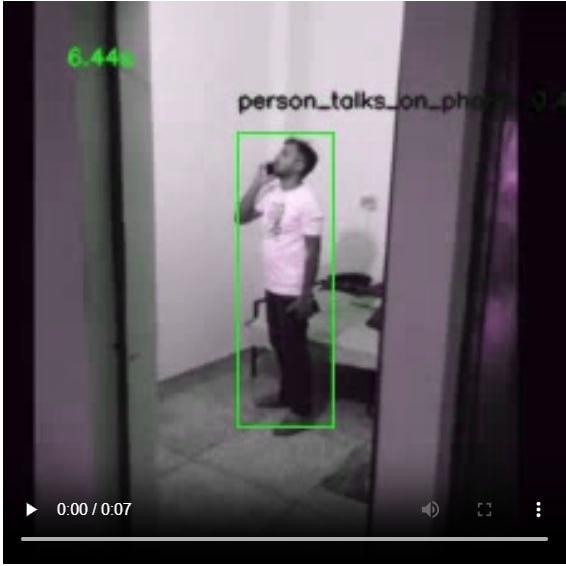

# IndustrialMotionDetection

<a target="_blank" href="https://cookiecutter-data-science.drivendata.org/">
    
</a>

==============================
<div style="display: flex; justify-content: center;">
  
  
</div>


**IndustrialMotionDetection** - это библиотека для распознавания действий человека на производстве.

В условиях существующих систем видеонаблюдения существует потребность в инструментах, способных точно идентифицировать некоторые действия работников и своевременно предупреждать о потенциально опасных ситуациях. На данный момент решения в этой области ограничены коммерческими продуктами, доступ к которым затруднен для широкого круга пользователей, либо носят узкоспециализированный характер и требуют адаптации под конкретные условия применения.

**В результате чего наша команда выделила набор актуальных действий:**
1) Перемещение предметов, оборудования
2) Использование инструментов
3) Использование смартфона/телефона
4) Курение
5) Прием пищи или напитков
6) Нахождение на рабочем месте в определенной зоне
7) Взаимодействие с другими людьми (разговор, рукопожатие, объятие) 
8) Поднятие по лестнице с тремя точками опоры
9) Нахождение человека в запретной зоне
10) Саботаж камер 

## Распознавание действий

Поскольку действия, которые мы анализируем, имеют различный характер и требуют разных подходов к обработке данных, мы приняли решение разделить их на отдельные модели.

В результате мы разработали следующую структуру:

### **Модель VideoMAE** 
- Перемещение предметов, оборудования
- Использование смартфона/телефона
- Взаимодействие с другими людьми (разговор, рукопожатие, объятие)

<ins> сюда закинуть краткое описание модели и действий</ins>

### **Модель Yolo Pose Estimation + DepthAnything** 
- Подъем по лестнице с тремя точками опоры: проверка соблюдения человеком правил безопасности при подъеме по лестнице, используя три точки опоры для предотвращения падений и травм.

- Нахождение человека в запретной зоне: инентификация случаев несанкционированного доступа в зоны, представляющие потенциальную опасность или требующие специального разрешения.

- Саботаж камер: обнаружение попыток вмешательства в работу камер, такие как их блокировка, повреждение или намеренное изменение угла обзора.

Модель состоит из YOLOv11 Pose Estimation, DepthAnything и SAM&DINO. 

### **Модель** 
- Использование инструментов
- Нахождение на рабочем месте в определенной зоне
- Курение

<ins> сюда закинуть краткое описание модели и действий</ins>


## Архитектура проекта

```
├── LICENSE            <- Open-source license if one is chosen
├── Makefile           <- Makefile with convenience commands like `make data` or `make train`
├── README.md          <- The top-level README for developers using this project.
├── data
│   ├── external       <- Data from third party sources.
│   ├── interim        <- Intermediate data that has been transformed.
│   ├── processed      <- The final, canonical data sets for modeling.
│   └── raw            <- The original, immutable data dump.
│
├── docs               <- A default mkdocs project; see www.mkdocs.org for details
│
├── models             <- Trained and serialized models, model predictions, or model summaries
│
├── notebooks          <- Jupyter notebooks. Naming convention is a number (for ordering),
│                         the creator's initials, and a short `-` delimited description, e.g.
│                         `1.0-jqp-initial-data-exploration`.
│
├── pyproject.toml     <- Project configuration file with package metadata for 
│                         src and configuration for tools like black
│
├── references         <- Data dictionaries, manuals, and all other explanatory materials.
│
├── reports            <- Generated analysis as HTML, PDF, LaTeX, etc.
│   └── figures        <- Generated graphics and figures to be used in reporting
│
├── requirements.txt   <- The requirements file for reproducing the analysis environment, e.g.
│                         generated with `pip freeze > requirements.txt`
│
├── setup.cfg          <- Configuration file for flake8
│
└── src   <- Source code for use in this project.
    │
    ├── __init__.py             <- Makes src a Python module
    │
    ├── config.py               <- Store useful variables and configuration
    │
    ├── dataset.py              <- Scripts to download or generate data
    │
    ├── features.py             <- Code to create features for modeling
    │
    ├── modeling                
    │   ├── __init__.py 
    │   ├── predict.py          <- Code to run model inference with trained models          
    │   └── train.py            <- Code to train models
    │
    └── plots.py                <- Code to create visualizations
```
